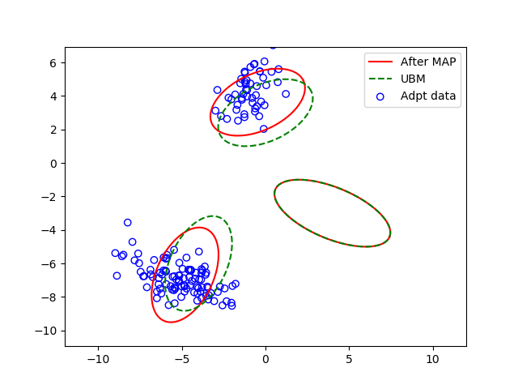

# GMMMAP
MAP Adaptation for GMM

## Run Demo
```python
python gmmadpt.py
```

## Results


## Usage
```python
# ========== Input Argument Foramt
# gmm: The input gmm (usaully represented as UBM), has format
# 	gmm['mu']: (K,p)
# 	gmm['prec']: (K,p,p)
# 	gmm['cov']: (K,p,p)
# 	gmm['w']: (K,)
# X: New data that is used for adaptation, has format
# 	(p, T), where p is dimension, T is number of observations
# priorRatio is a scalar
# 	representing the data number precentage of UBM
# 	e.g. if T=500, and priorRatio=0.25, then we assume we have tau = (500/0.75)*0.25
# maxItrNum: Number of EM iteration
# adptW, adptM, adptCov: Boolean indicates wheter adapt weight, mean, covariance
# hyper: The hyper-parameters (or super-parameters) used for adaptation. We use normal-inverse-Wishart as [Conjugate Prior](https://en.wikipedia.org/wiki/Conjugate_prior)
# ========== Output Foramt
# gmm: The returned adapted gmm
# rtn_hyper: The returned hyper-parameters
def gmmMap(in_gmm,X,priorRatio,maxItrNum=10,adptW=False,adptM=True,adptCov=False,hyper=None):
  ...
  return gmm, rtn_hyper

# You can do something like this to achieve online adaptation:
gmmAdpt1, rtn_hyper1 = gmmMap(in_gmm,X1,priorRatio,maxItrNum=10,adptW=False,adptM=True,adptCov=False,hyper=None)
gmmAdpt2, rtn_hyper2 = gmmMap(gmmAdpt1,X2,priorRatio,hyper=rtn_hyper1)
gmmAdpt3, rtn_hyper3 = gmmMap(gmmAdpt2,X3,priorRatio,hyper=rtn_hyper2)
...
```

Enjoy!
